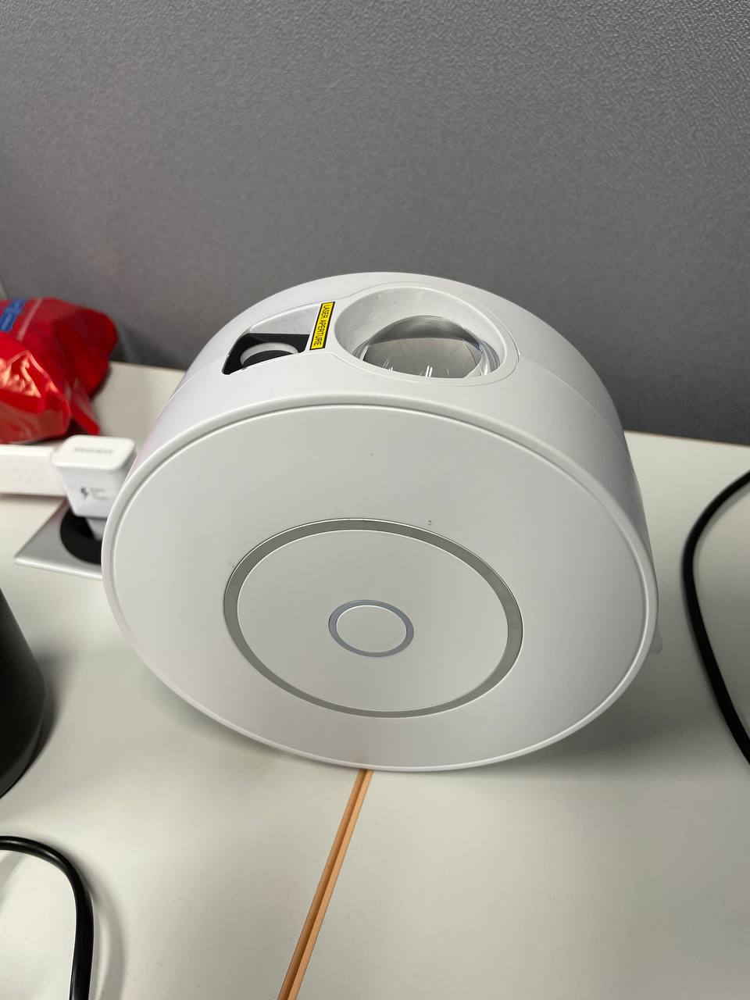

# ESPHome for Tuya SK20 WiFi Nebula Light

This repository contains an esphome configuration file for flashing esphome to Tuya SK20 nebula lights.
Thanks to the amazing work of a lot of other people no disassembly or soldering is required.
You can simply jailbreak the device using your laptop and flash ESPhome (or any other LibreTiny / WB3S-compatible firmware).

## References

The following repositories, projects and tools helped a lot in jailbreaking my nebula light:
- teardown, research and pictures: https://github.com/kireque/esphome_nebula_light
- basic/unfinished esphome config for included uC: https://github.com/fonix232/esphome_nebula_light
- exploit to flash tuya devices without disassembly: https://github.com/tuya-cloudcutter/tuya-cloudcutter
- esphome support for BK7231T devices: https://docs.libretiny.eu/
- tutorial on flashing esphome: https://docs.libretiny.eu/docs/flashing/tools/cloudcutter/

## Pictures




## Basic instructions
This guide assumes you have a Linux computer and some basic terminal knowledge


Flash esphome-quickstart using [tuya-cloudcutter.sh](https://github.com/tuya-cloudcutter/tuya-cloudcutter):
```bash
git clone https://github.com/tuya-cloudcutter/tuya-cloudcutter
sudo ./tuya-cloudcutter.sh
```

The program will guide you through the installation procedure, asking for the following information:
- (2) Flash 3rd Party Firmware
- By manufacturer/device name
- Tuya Generic
- SK20 Smart Star Projector
- 1.1.2 - BK7231T / oem_bk7231t_light3_laser_nanxin
- ESPHome-Kickstart-v23.08.29_bk7231t_app.ota.ug.bin

Create a `secrets.yaml` file inputting your own parameter:
```yaml
wifi_ssid: "<your SSID>"
wifi_password: "<your wifi password>"
wifi_fallback_password: "<some random password>"
ota_password: "<some random password>"
api_password: "<either: your home assistant api password>"
```

and then build an esphome image using the following commands:
```bash
$ pip install esphome
$ esphome compile wb3s_nebula_light.yaml
```

Now connect to the nebula light AP use the OTA file select to select the compiled binary found at: `./.esphome/build/sternenhimmel/.pioenvs/sternenhimmel/image_bk7231t_app.ota.ug.bin`

The nebula light should now connect to your Wifi and/or host its own fallback AP.
