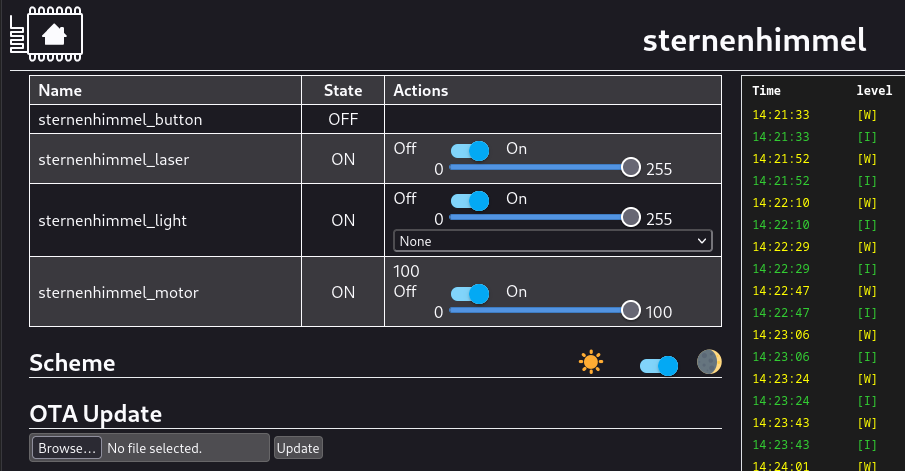

# ESPHome for Tuya SK20 WiFi Nebula Light

This repository contains an esphome configuration file for flashing esphome to Tuya SK20 nebula lights.
Thanks to the amazing work of a lot of other people no disassembly or soldering is required.
You can simply jailbreak the device using your laptop and flash ESPhome (or any other LibreTiny / WB3S-compatible firmware).

## References

The following repositories, projects and tools helped a lot in jailbreaking my nebula light:
- teardown, research and pictures: https://github.com/kireque/esphome_nebula_light
- basic/unfinished esphome config for included uC: https://github.com/fonix232/esphome_nebula_light
- exploit to flash tuya devices without disassembly: https://github.com/tuya-cloudcutter/tuya-cloudcutter
- esphome support for BK7231T devices: https://docs.libretiny.eu/
- tutorial on flashing esphome: https://docs.libretiny.eu/docs/flashing/tools/cloudcutter/
- discussion regarding the esphome configuration for this nebula device: https://github.com/kireque/esphome_nebula_light/issues/8

## Pictures




## Basic instructions
This guide assumes you have a Linux computer and some basic terminal knowledge.
The used tools also have some prerequisites like `python`, `docker` and `plattform.io`
Make sure you have [the esphome CLI](https://esphome.io/guides/getting_started_command_line) installed

Configure your secrets by creating the following `secrets.yaml` file:
```yaml
wifi_ssid: "<your SSID>"
wifi_password: "<your wifi password>"
wifi_fallback_password: "<some random password>"
ota_password: "<some random password>"
api_password: "<your home assistant api password>"
```

Create a file called `nebula.yaml` with the following contents:
```yaml
# using esphome API for homeassistant
api:
  password: !secret api_password

# OR: use MQTT
#mqtt:
#  broker: !secret mqtt_broker

packages:
  remote_package:
    url: https://github.com/M4GNV5/esphome-SK20-Nebula-Light.git
    ref: master
    files: [recommended_base.yaml, platform_bk72xx.yaml, nebula_light_device.yaml]
```

Then, build and flash the image using the following commands:
```bash
$ git clone https://github.com/tuya-cloudcutter/tuya-cloudcutter
$ esphome compile nebula.yaml
$ cp ./.esphome/build/nebula/.pioenvs/nebula/image_bk7231t_app.ota.ug.bin tuya-cloudcutter/custom-firmware/star_nebula_bk7231t.ota.ug.bin
$ sudo ./tuya-cloudcutter.sh
```

The last program will guide you through the jailbreaking procedure, asking you for the following information. You will also have to long press the device button for a few seconds twice until it is slow blinking (WiFi AP mode):
- (2) Flash 3rd Party Firmware
- By manufacturer/device name
- Tuya Generic
- SK20 Smart Star Projector
- 1.1.2 - BK7231T / oem_bk7231t_light3_laser_nanxin
- `star_nebula_bk7231t.ota.ug.bin`

The nebula light should now connect to your Wifi and/or host its own fallback AP.
